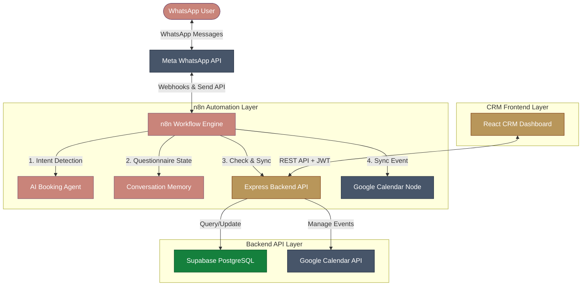

# GlowAssist AI — Clinic Receptionist & CRM Dashboard

GlowAssist AI is a premium, full-stack AI-driven clinic receptionist and customer relationship management (CRM) dashboard designed for **Westhill Nails & Spa**. It automates appointment bookings, reschedules, status checks, and cancellations via a WhatsApp conversational agent, syncing everything in real time to a secure Supabase database and a Google Calendar workspace, while presenting live analytics and administrative tools in a React CRM dashboard.

---

## 🏛️ System Architecture & Data Flow

Below is the conceptual structure showing how the WhatsApp conversational agent, Express.js backend API, Supabase database, Google Calendar, and the React CRM dashboard collaborate:



### How It Works:
1. **WhatsApp Message Received:** A client messages the Westhill Nails & Spa WhatsApp business account.
2. **Intent Classification:** The **n8n Webhook Workflow** captures the text and queries an LLM to classify the user's intent:
   * **General Inquiry / FAQs:** Routed to the existing Vector Store QA database.
   * **Book / Reschedule / Cancel / Check Appointment:** Routed to the dynamic booking intelligence layer.
3. **State Machine Questionnaire:** If booking, n8n checks which of the 8 required client fields are missing from the ongoing conversation state. It asks the client for the *first* missing field sequentially.
4. **Backend REST Calls:** Once all variables are collected, n8n invokes the Express.js Backend API using a secure JWT bearer token.
5. **Anti-Double-Booking & Slot Check:** The backend checks the Supabase database for working hours and overlapping bookings:
   * **If Slot Available:** The backend registers the client profile and creates the appointment, then creates a Google Calendar event, returning the Google Event ID.
   * **If Slot Taken:** The backend computes the next 3 available 30-minute slots and returns them as conversational options.
6. **Live Dashboard Sync:** The React CRM dashboard receives real-time KPI updates (Revenue, AI vs. manual booking counts, live schedules) and renders them immediately using dynamic data caching.
7. **Automated Reminders:** Independent hourly cron jobs query the database to send highly personalized WhatsApp reminder templates at the 24-hour and 2-hour thresholds.

---

## 📂 Repository Directory Layout

The workspace is organized into separate specialized modules, each equipped with its own dedicated setup guidelines:

```
glowassist-clinic-receptionist/
├── database/                   # Database schemas and seed migrations
│   └── schema.sql              # Supabase tables, indexes, RLS, and spa seeds
├── backend/                    # Express.js, JWT security, Google OAuth, and validation
│   ├── server.js               # Listener entrypoint
│   ├── src/                    # API Controllers, routes, and services
│   └── README.md               # Backend installation & startup guide
├── frontend/                   # React + TypeScript + Vite + Zustand CRM Dashboard
│   ├── src/pages/              # Analytics, Clients CRM, FullCalendar schedulers
│   ├── package.json            # Front-end dependencies
│   └── README.md               # Frontend installation & startup guide
└── n8n-workflows/              # Importable JSON canvases & cron loggers
    ├── workflows/              # Receptionist & Reminder workflows
    └── README.md               # n8n import, credentials, and cron setup guide
```

---

## ⚡ Step-by-Step Installation & System Boot

Follow this sequence to install and run the entire GlowAssist AI system in a fresh environment:

### Prerequisites:
Make sure you have the following global dependencies installed on your system:
* **Node.js** (v18 or higher recommended)
* **npm** (v9 or higher) or **yarn**
* **Git**

---

### Step 1: Clone the Repository
Clone the repository and navigate to the project directory:
```bash
git clone https://github.com/your-username/glowassist-clinic-receptionist.git
cd glowassist-clinic-receptionist
```

---

### Step 2: Database Setup (Supabase)
1. Register or log in to the **[Supabase Console](https://supabase.com)**.
2. Create a new project named `Westhill Nails & Spa`.
3. Navigate to the **SQL Editor** tab in the Supabase Dashboard.
4. Copy the entire contents of the database schema file:
   👉 **[`database/schema.sql`](file:///d:/Mayur/n8n%20projects/clinic%20receptionist/database/schema.sql)**
5. Click **Run** to execute the query. This builds the 7 tables, sets up indices, creates row-level security (RLS) policies, and seeds dynamic spa services (Gel Manicure, Pedicure, Botox, Dermal Fillers) and staff records.

---

### Step 3: Backend Setup
Configure and boot the backend Express API server:
1. Navigate to the `backend` directory:
   ```bash
   cd backend
   ```
2. Install npm packages:
   ```bash
   npm install
   ```
3. Create your backend `.env` configuration file (referencing the template in `backend/README.md`) and populate your Supabase and Google Calendar credentials.
4. Start the server in development mode:
   ```bash
   npm run dev
   ```
*The server will boot and listen on **http://localhost:3001**.*

---

### Step 4: Frontend Setup
Configure and boot the React CRM dashboard:
1. Open a new terminal window and navigate to the `frontend` directory:
   ```bash
   cd ../frontend
   ```
2. Install npm packages:
   ```bash
   npm install
   ```
3. Create your frontend `.env` configuration file mapping to the backend API port:
   ```env
   VITE_API_BASE_URL=http://localhost:3001
   VITE_N8N_WEBHOOK_URL=http://localhost:5678
   ```
4. Start the local development server:
   ```bash
   npm run dev
   ```
*Open **http://localhost:5173** in your browser to view the live dashboard.*

---

### Step 5: n8n Workflow Integration
Import the conversational booking engines:
1. Start your local n8n instance:
   ```bash
   n8n start
   ```
2. Open your n8n workspace panel (**http://localhost:5678**).
3. Import the primary receptionist workflow file:
   👉 **[`glowassist-receptionist-v2.json`](file:///d:/Mayur/n8n%20projects/clinic%20receptionist/n8n-workflows/workflows/glowassist-receptionist-v2.json)**
4. Import the reminders and logger workflow file:
   👉 **[`whatsapp-reminders-and-conv-logger.json`](file:///d:/Mayur/n8n%20projects/clinic%20receptionist/n8n-workflows/workflows/whatsapp-reminders-and-conv-logger.json)**
5. Link your WhatsApp Business API, Gemini API, and Backend JWT credentials as explained in the n8n sub-README.

---

## 🛠️ Technology-Specific Guides

For deep structural details and technology-specific setups, refer to the individual README guides inside each sub-directory:
* 💻 **[Express Backend API Guide](file:///d:/Mayur/n8n%20projects/clinic%20receptionist/backend/README.md)**
* 🎨 **[React CRM Frontend Guide](file:///d:/Mayur/n8n%20projects/clinic%20receptionist/frontend/README.md)**
* 🔄 **[n8n Workflow Setup Guide](file:///d:/Mayur/n8n%20projects/clinic%20receptionist/n8n-workflows/README.md)**

---

## 📄 License
This project is private and proprietary, configured exclusively for Westhill Nails & Spa.
