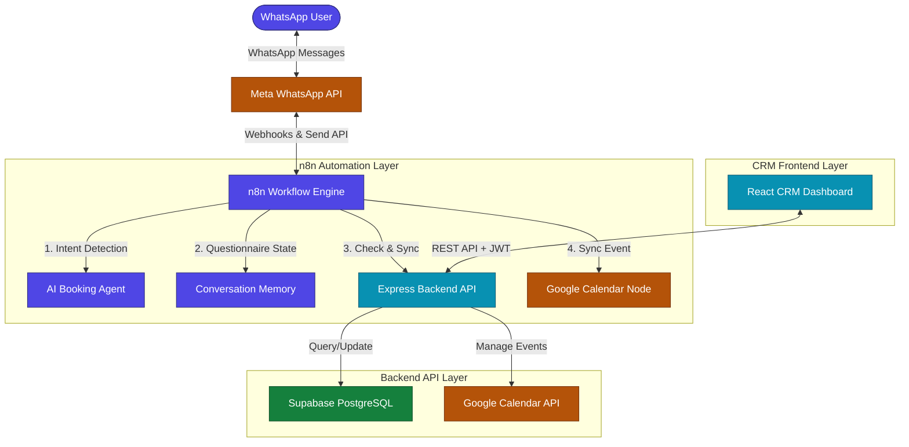

# Clinic Receptionist — Global Master Plan

This global plan outlines the end-to-end implementation for adding **Appointment Booking** and **Google Calendar Integration** to the existing WhatsApp AI Receptionist, without altering any existing AI service logic or knowledge base systems.

---

## 📋 Table of Contents
1. [System Architecture](#-system-architecture)
2. [Workflow Execution Flow](#%EF%B8%8F-workflow-execution-flow)
3. [Component Matrix](#-component-matrix)
4. [Agent & Reviewer Responsibilities](#%EF%B8%8F-agent--reviewer-responsibilities)
5. [Implementation Roadmap (Phase 18)](#-implementation-roadmap-phase-18)
6. [Technology Plans](#%EF%B8%8F-technology-plans)

---

## 🏛️ System Architecture

The following block diagram represents the complete data and communication flow:



---

## ⚙️ Workflow Execution Flow

Below is the message-by-message execution flow for a client requesting a booking:

```
WhatsApp User Message
    ↓
Meta WhatsApp API Webhook
    ↓
n8n Workflow Trigger
    ↓
AI Intent Detection (General Inquiry, Booking, Reschedule, Check, Cancel)
    ↓
Collect User Details (Sequential questionnaire: Name, Phone, Service, Date, Time, Payment, Notes)
    ↓
Check Existing Appointment (Database lookup via Backend: phone number + future scheduled status)
    ↓
Create / Reschedule Decision
    ├─► Existing Appointment Found: AI alerts client + updates old to rescheduled/cancelled
    └─► No Existing Appointment: Creates new record in Supabase
    ↓
Google Calendar Node (Creates/Updates Event with client & booking details)
    ↓
Save Event ID & Sync metadata inside Supabase
    ↓
WhatsApp Confirmation message sent back to User
```

---

## 📦 Component Matrix

Here is how the modules are divided across the workspace directories:

| Component | Directory | Technology Stack | Purpose |
| :--- | :--- | :--- | :--- |
| **Global Master Plan** | `./plan.md` | Markdown | Master tracking, architecture, and overall execution |
| **Database Plan** | `./database/plan.md` | Supabase / SQL | Schema design, RLS policies, indexing, and seeds |
| **Backend Plan** | `./backend/plan.md` | Express.js / Node.js | REST APIs, Google Calendar services, auth, and validations |
| **Frontend Plan** | `./frontend/plan.md` | React / TS / Material UI | CRM dashboard, calendars, client tables, and metrics |
| **Workflow Plan** | `./n8n/plan.md` | n8n / Webhooks | Intent routing, detail collection, GCal node configuration |

---

## 🕵️‍♂️ Agent & Reviewer Responsibilities

To automate verification, testing, and alignment across features, we configure the custom workspace agents and reviewers:

### 1. `code-reviewer` Agent ([code-reviewer.md](file:///d:/Mayur/n8n%20projects/clinic%20receptionist/agents/code-reviewer.md))
- **Primary Task**: Review all file edits in `backend/` and `frontend/` to ensure they strictly follow standard architectural patterns.
- **Specific Checklist Items**:
  - Verify that the Express backend does not bypass the Service layer for database queries.
  - Ensure strict TypeScript typing (`no-explicit-any`).
  - Verify that all inputs in the controller are sanitized and validated.

### 2. `security-auditor` Agent ([security-auditor.md](file:///d:/Mayur/n8n%20projects/clinic%20receptionist/agents/security-auditor.md))
- **Primary Task**: Ensure client personal data (HIPAA context) and environment variables are strictly secure.
- **Specific Checklist Items**:
  - Enforce Supabase Row-Level Security (RLS) on all new tables (`clients`, `appointments`, `crm_live_chats`).
  - Ensure JWT authorization is active on all Express routes (except webhook/public routes).
  - Check that no sensitive credentials (`SUPABASE_SERVICE_ROLE_KEY` or Google tokens) are leaked in client responses or git logs.

### 3. Custom Receptionist Skill ([SKILL.md](file:///d:/Mayur/n8n%20projects/clinic%20receptionist/skills/SKILL.md))
- **Primary Task**: Provide direct instructions for handling multi-tenant booking, validation, and n8n custom payloads.

---

## 🚀 Implementation Roadmap (Phase 18)

This project must be completed in the exact sequential order specified below to ensure backend-to-frontend compatibility:

### 🟩 Step 1: Supabase Tables Setup
- **Responsibility**: Database Plan
- **Deliverables**: Execution of SQL Schemas for `clients`, `appointments`, `crm_live_chats`, and auxiliary tables like `services` and `payments`. Setup of indexes and Row Level Security.

### 🟩 Step 2: Backend APIs Implementation
- **Responsibility**: Backend Plan
- **Deliverables**: Controller, router, and service layer setup for Clients, Appointments, and Dashboard statistics. Setup JWT Auth.

### 🟩 Step 3: Google Calendar API Integration
- **Responsibility**: Backend & n8n
- **Deliverables**: OAuth2/refresh token integrations. Services in backend to Create, Update, and Cancel Google Calendar Events.

### 🟩 Step 4: Update n8n Workflows
- **Responsibility**: Workflow Plan
- **Deliverables**: Import new nodes for AI Intent Detection, Questionnaire State Machine, HTTP Request node, Google Calendar Sync, and WhatsApp Webhook replies.

### 🟩 Step 5: Frontend CRM Development
- **Responsibility**: Frontend Plan
- **Deliverables**: React CRM with Dashboard widgets, Client grid tables, Interactive Calendars, and action modals (reschedule/cancel).

### 🟩 Step 6: Dashboard Analytics & Metrics
- **Responsibility**: Frontend & Backend
- **Deliverables**: Aggregated API endpoints to serve real-time statistics (Revenue, AI bookings, Manual bookings, Pending payments).

### 🟩 Step 7: Automation & WhatsApp Reminders
- **Responsibility**: Workflow Plan
- **Deliverables**: Scheduled cron jobs in n8n triggers to send automated WhatsApp reminders at `24-hour` and `2-hour` marks.

---

## 🛠️ Technology Plans

Below are the summarized execution targets for each technology, referencing their full detailed sub-plans:

### 🛡️ 1. Database Layer (`database/plan.md`)
- **Engine**: Supabase PostgreSQL
- **Key Tables**: `clients`, `appointments`, `crm_live_chats`, plus recommended addition: `services`.
- **Integrity**: Row Level Security (RLS) enabled on all tables. Indices on `phone_number` and `appointment_date` for super-fast lookups.
- **Detailed Sub-Plan**: Go to [database/plan.md](file:///d:/Mayur/n8n%20projects/clinic%20receptionist/database/plan.md)

### 💻 2. Backend Layer (`backend/plan.md`)
- **Framework**: Node.js + Express.js + Supabase SDK
- **Key APIs**:
  - Client APIs (`POST /api/clients`, `GET /api/clients`, `PUT /api/clients/:id`)
  - Appointment APIs (`POST /api/appointments`, `PUT /api/appointments/:id/reschedule`, `PUT /api/appointments/:id/cancel`)
  - Dashboard Metrics (`GET /api/dashboard/stats`)
- **Business Logic**: Prevent double-booking via Time Slot Validation. Allow bookings only within Working Hours.
- **Detailed Sub-Plan**: Go to [backend/plan.md](file:///d:/Mayur/n8n%20projects/clinic%20receptionist/backend/plan.md)

### 🎨 3. Frontend Layer (`frontend/plan.md`)
- **Framework**: React + TypeScript + Material UI + React Query + Redux Toolkit
- **Pages**:
  - **Dashboard**: Real-time KPI widgets for revenue, booking sources, and appointment status.
  - **Clients Grid**: Search, filters (VIP/First-time), and deep booking histories.
  - **Appointments Page**: Toggleable Calendar and List views. Status filtering and action trigger buttons.
- **Detailed Sub-Plan**: Go to [frontend/plan.md](file:///d:/Mayur/n8n%20projects/clinic%20receptionist/frontend/plan.md)

### 🔄 4. n8n Automation Layer (`n8n/plan.md`)
- **Platform**: n8n Workflow Automation
- **Scope**: AI Booking Agent Intent Detection (book, reschedule, check, cancel). Sequence flows for questionnaires, Google Calendar node sync, and automated reminder CRON schedules.
- **Rule**: Absolutely **no changes** to existing non-appointment node branches (e.g. general salon question answering, vector stores, and pricing knowledge bases).
- **Detailed Sub-Plan**: Go to [n8n/plan.md](file:///d:/Mayur/n8n%20projects/clinic%20receptionist/n8n/plan.md)

---

> [!IMPORTANT]
> This global plan serves as the single source of truth for the entire development team and agent systems. All commits and code changes must align with the schedules, structures, and security specifications detailed herein.
